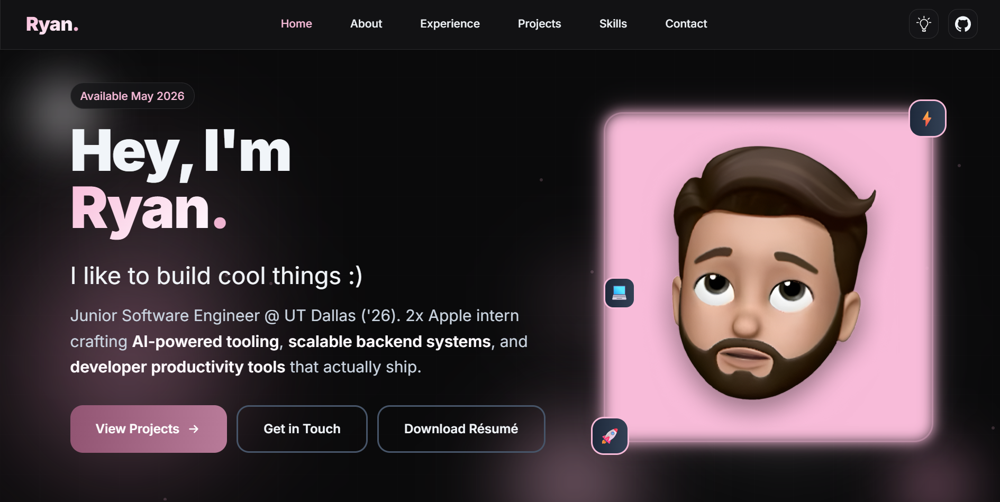

# Ryan Polasky - Portfolio Website

A modern, responsive portfolio website showcasing my work as a Junior Software Engineer.

## About

This is my personal portfolio website built with modern web technologies. It features a dark theme with customizable accent colors, smooth animations, and a professional design.

## Features

- **Responsive Design**: Works seamlessly across desktop, tablet, and mobile devices
- **Dark Theme**: Professional dark theme with customizable accent colors
- **Interactive Elements**: Smooth scrolling, hover effects, and animated components
- **Contact Form**: Functional contact form powered by Formspree
- **Performance Optimized**: Fast loading with optimized assets and animations

## Sections

- **Home**: Introduction and overview
- **About**: Personal background and quick stats
- **Experience**: Professional work history and achievements
- **Projects**: Featured projects and technical work
- **Skills**: Technical skills with visual progress indicators
- **Testimonials**: Feedback from colleagues and teammates
- **Contact**: Contact form and quick contact options

## Technologies Used

- **Frontend**: HTML5, CSS3, JavaScript
- **Styling**: Tailwind CSS
- **Fonts**: Inter (sans-serif), JetBrains Mono (monospace)
- **Form Handling**: Formspree
- **Animations**: CSS animations and transitions

## Color Themes

The website features a customizable color picker with multiple accent color options:
- Blue
- Purple
- Green
- Orange
- Red
- Magenta
- Cyan
- Pink

Colors are randomly selected on each page load for a fresh experience every time!

## Local Development

1. Clone the repository
2. Install dependencies: `npm install`
3. Build CSS: `npm run build` (or `npm run build:debug` for verbose output)
4. Open `index.html` in your browser

### Build Process

This project uses Tailwind CSS for styling. The build process compiles the utility classes from `src/input.css` into the final `styles.css` file.

**Available Scripts:**
- `npm run build` - Build CSS for production
- `npm run build:debug` - Build CSS with verbose logging
- `npm run watch` - Watch for changes and rebuild automatically

**Note:** Make sure to run the build command after making changes to HTML files or Tailwind classes to ensure all utility classes are generated properly.

## About & Contact

You're more than welcome to clone this repository, steal the code, say you wrote it yourself! It's open source for a 
reason! If you have any questions, you can reach me via any of the following:

- **Email**: ryanpolasky@hotmail.com
- **LinkedIn**: [ryan-polasky](https://www.linkedin.com/in/ryan-polasky/)
- **Discord**: [eggyb0i](https://discordapp.com/users/209393428570570752)

## License

© 2026 Ryan Polasky. All rights reserved.
